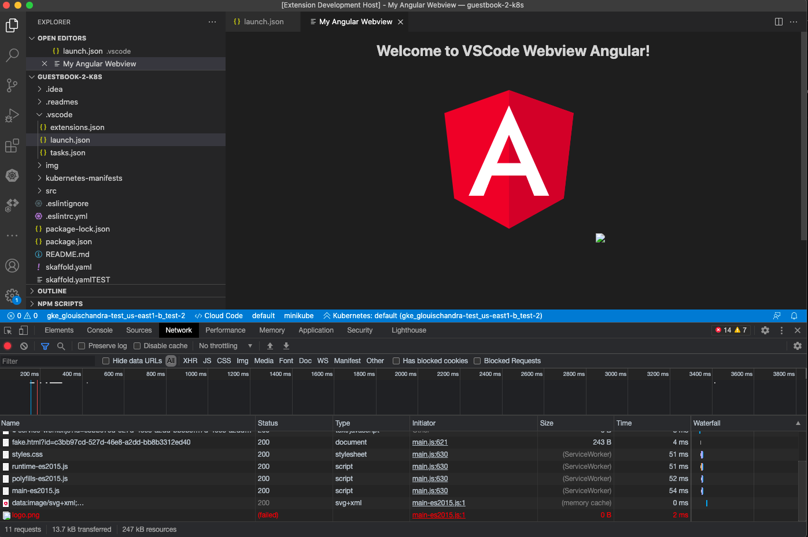

# Minimal repro for 1.56 resource loading issue

Simply run the extension in VSCode 1.56 or insider and type Command Pallete > "Angular: Open webview". 
Within the developer toolbar you should see logo.png request failed to be fetched, in this case Angular framework does the image request.
However uncomment line 20 in dist/index.html and the logo.png request succeeds and Angular was able to get the cached data.

